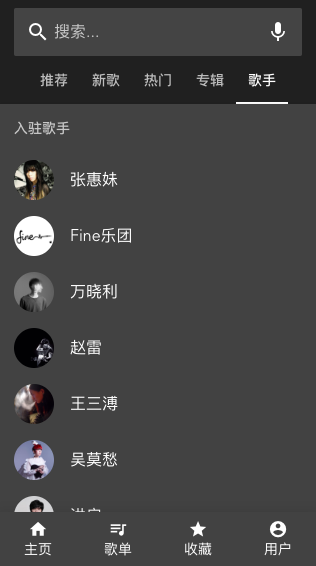
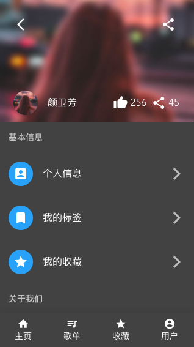

# 音乐播放app

* 基于手机端
* VUE全家桶(vue vue-router vuex)
* vuetify (一个基于Vue3.x的material design 风格UI框架)
* stylus 预处理
* 数据接口  [neteasecloudmusicapi](https://binaryify.github.io/NeteaseCloudMusicApi/#/?id=neteasecloudmusicapi) 端口：3000

## 运行截图






## 运行项目

```
npm install
npm run serve
npm run build
npm run lint
```

## 待完善

* 列表播放
* 上拉加载
* 下拉刷新
* 用户登录
* 收藏